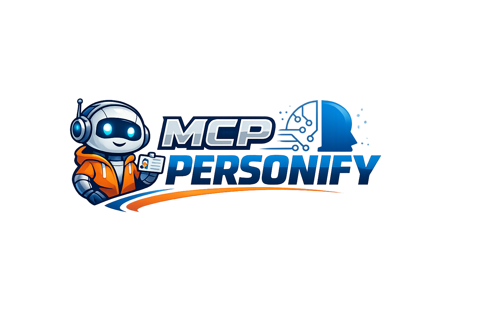

<p align="center">
  <strong>English</strong> | <a href="README.ja.md">日本語</a> | <a href="README.zh.md">中文</a> | <a href="README.es.md">Español</a> | <a href="README.fr.md">Français</a> | <a href="README.hi.md">हिन्दी</a> | <a href="README.it.md">Italiano</a> | <a href="README.pt-BR.md">Português</a>
</p>

<p align="center">
  
</p>

<p align="center">
  <a href="https://github.com/mcp-tool-shop-org/mcp-personify/actions/workflows/ci.yml"></a>
  <a href="LICENSE"></a>
  <a href="https://mcp-tool-shop-org.github.io/mcp-personify/"></a>
</p>

> **Prototype** — VRM avatar with real-time TTS lipsync and expression mapping in Unreal Engine 5

Runtime VRM avatar system that connects to a local TTS bridge for speech synthesis, viseme-driven lipsync, and emotion-expression mapping. Ported from the Godot prototype ([avatar-face-mvp](https://github.com/mcp-tool-shop-org/avatar-face-mvp)).

## Status

| Feature | State |
|---------|-------|
| VRM 0.x / 1.0 loading (VRM4U) | Scaffold |
| TTS bridge (WebSocket) | Scaffold |
| Viseme lipsync (5 bands) | Scaffold |
| Emotion expressions | Scaffold |
| Bridge auto-start | Scaffold |
| Morph target cache | Scaffold |

## Stack

| Component | Choice |
|-----------|--------|
| Engine | Unreal Engine 5.7.3 |
| VRM | [VRM4U](https://github.com/ruyo/VRM4U) plugin |
| WebSocket | Built-in `IWebSocket` (WebSockets module) |
| TTS | [voice-soundboard-mcp](https://github.com/mcp-tool-shop-org/voice-soundboard-mcp) via bridge |
| Audio | `UAudioComponent` + amplitude-based visemes |

## Setup

### Prerequisites
- Unreal Engine 5.7 LTS
- Node.js 18+
- `@mcptoolshop/voice-soundboard-mcp` installed globally

### 1. Clone and open
```bash
git clone https://github.com/mcp-tool-shop-org/mcp-personify.git
```
Open `mcppersonify.uproject` in UE5. It will prompt to compile the C++ module.

### 2. Install VRM4U plugin
1. Download `VRM4U_5_7.zip` from [VRM4U releases](https://github.com/ruyo/VRM4U/releases)
2. Extract `VRM4U/` folder into `Plugins/` directory
3. Restart editor, enable plugin in Edit > Plugins

### 3. Install bridge dependencies
```bash
cd tools/tts-bridge
npm install
```

### 4. Add a VRM avatar
Place any `.vrm` file in `Content/Avatars/`. The loader auto-discovers the first one.

### 5. Set up the scene
1. Place a `PersonifyManager` actor in your level (search in Place Actors panel)
2. Press Play — bridge auto-starts, avatar loads, ready for TTS

## Architecture

```
Claude Code / MCP Host
    |
    v (MCP stdio)
voice-soundboard-mcp ──> .ogg/.wav files
    ^
    | (MCP stdio)
mcp-aside (optional) ──> emotion cues
    ^
    |
tools/tts-bridge/bridge.mjs  (Node.js, WebSocket on :9200)
    ^
    | (WebSocket JSON)
    v
Unreal Engine (UBridgeClient)
    |
    ├── UTtsAudioPlayer ──> UAudioComponent
    |       |
    |       v
    |   UVisemeDriverFFT ──> 5 viseme bands
    |       |
    |       v
    ├── UExpressionMapper ──> morph target weights
    |       |
    |       v
    └── UVrmAvatarLoader ──> VRM4U runtime load
            |
            v
        FBlendShapeCache ──> USkeletalMeshComponent lookup
```

## Source Files

```
Source/mcppersonify/
  mcppersonify.h/.cpp          Module entry point
  mcppersonify.Build.cs        Module build config
  PersonifyManager.h/.cpp      Main orchestrator actor
  BridgeClient.h/.cpp          WebSocket client (IWebSocket)
  TtsAudioPlayer.h/.cpp        Audio file loading + playback
  VisemeDriverFFT.h/.cpp       Amplitude → viseme bands
  BlendShapeCache.h/.cpp       Morph target name lookup
  ExpressionMapper.h/.cpp      Viseme/emotion → morph targets
  VrmAvatarLoader.h/.cpp       VRM4U runtime loader

tools/tts-bridge/
  bridge.mjs                   Node.js WebSocket ↔ MCP bridge
  package.json
```

## Bridge Protocol

**Unreal -> Bridge:**
- `{ "type": "speak", "text": "...", "voice": "am_fenrir", "emotion": "happy", "intensity": 0.7 }`
- `{ "type": "status" }` — get available voices
- `{ "type": "stop" }` — interrupt

**Bridge -> Unreal:**
- `{ "type": "tts.play", "path": "...", "durationMs": N, "emotion": "...", "intensity": N }`
- `{ "type": "tts.status", "voices": [...], "ready": true }`
- `{ "type": "aside.item", "meta": { "emotion": "...", "intensity": 0.5 } }`

## Roadmap to v0.1.0

- [ ] C++ module compiles clean in UE 5.7
- [ ] VRM4U loads and renders avatar in scene
- [ ] Bridge connects and receives TTS audio
- [ ] Visemes drive mouth morph targets
- [ ] Emotion expressions ramp on/off
- [ ] Bridge auto-starts on Play
- [ ] One-click package (.exe) works end-to-end

## License

MIT
